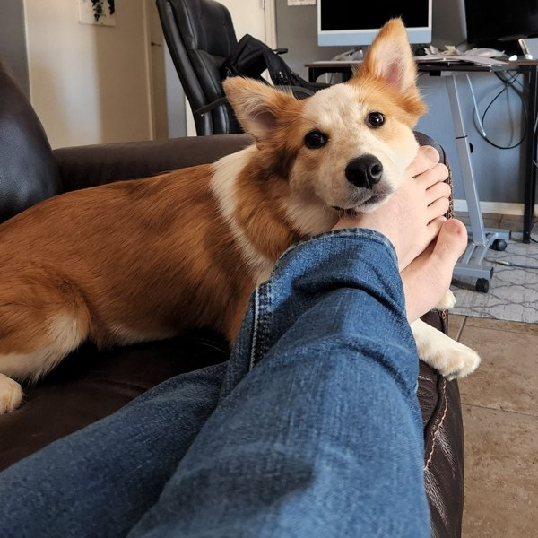
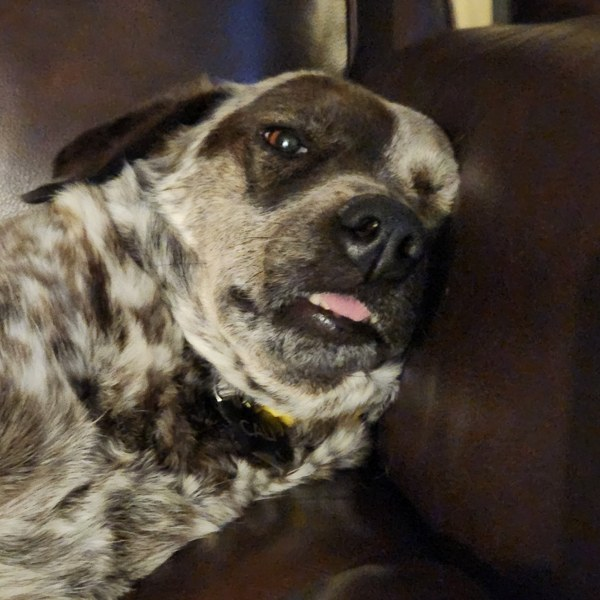
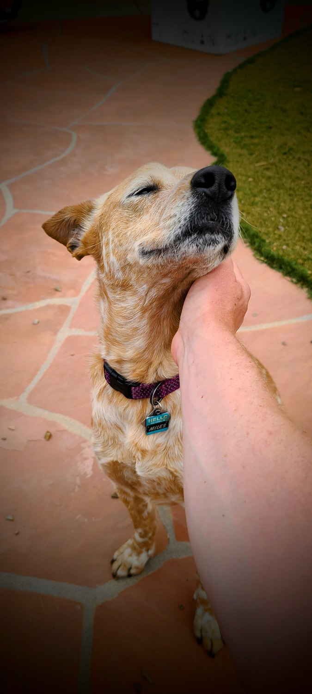
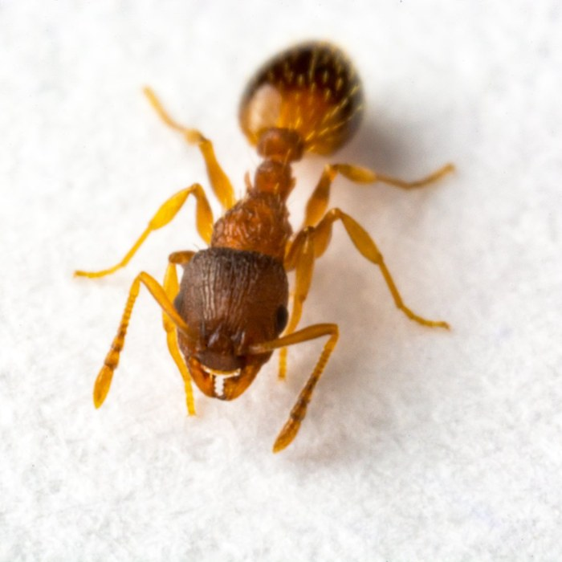
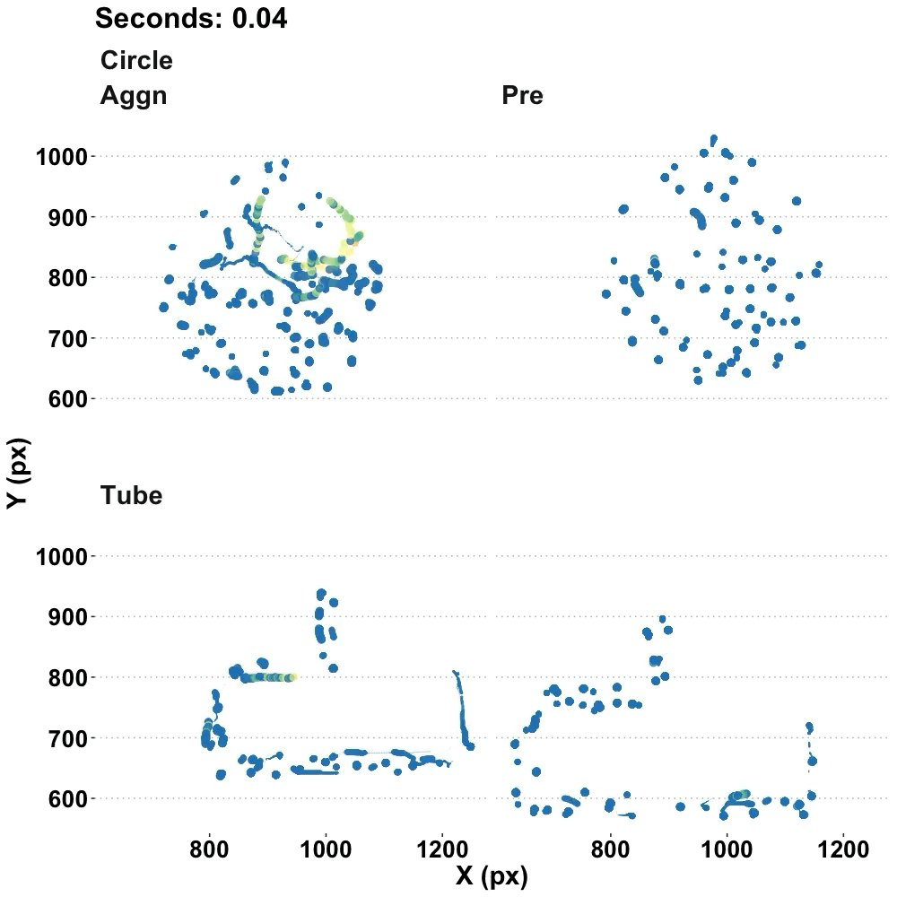
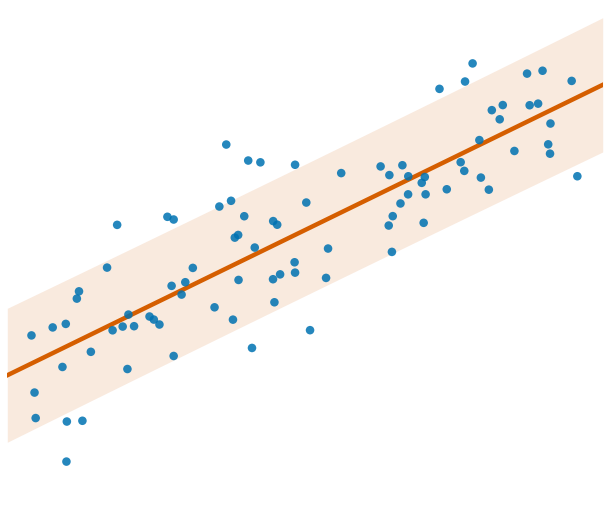

---
# YAML shape follows the module decks (see modules/m3-mle-uncertainty/m3a-*.qmd):
# only title/subtitle/author/institute/date. The revealjs format block, theme,
# embed-resources, KaTeX pin, and figure defaults are all inherited from
# _quarto.yml. Nothing about the shared format is overridden here.
#
# `data-no-attribution` is this deck's opt-out from theme/attribution.html, which
# appends the Clay Morrison credit to every deck's title slide. That credit is
# correct on the module decks (adapted from his lectures) and wrong on a personal
# introduction, so the shared script now honours this per-deck flag.
title: "Greg Chism"
subtitle: "From social insects to machine learning: data science grounded in messy, real-world systems."
author: "Assistant Professor of Practice · [gchism@arizona.edu](mailto:gchism@arizona.edu)"
institute: "College of Information Science · University of Arizona"
date: last-modified
date-format: "MMMM YYYY"
title-slide-attributes:
  data-no-attribution: "true"
  # Portrait is pre-composed onto a transparent 1920x1080 canvas (lower-right
  # circle) so it can be a plain reveal background. The deck adds no CSS of its
  # own, and the transparent canvas sits correctly on BOTH the dark and light
  # themes and on the forced-light PDF.
  data-background-image: "img/title-portrait-bg.png"
  data-background-size: "cover"
---

```{python}
#| label: setup
#| include: false
# ---------------------------------------------------------------------------
# Deck setup. Runs from the project root (execute-dir: project), so the shared
# helpers import the same way from any deck depth, identical to the module decks.
#
# This deck uses NO NHANES data: every number is a published figure from one of
# two sources, hard-coded here so the slide and the paper can be diffed by eye.
#   [1] De La Rosa, Chism, Herder, Mun & Aaron (2026), J. Affect. Disord. 405:121496
#   [2] "State AI Legislation Project: Status Report" (corpus frozen 2026-07-10)
# ---------------------------------------------------------------------------
import sys
sys.path.insert(0, "shared")

import numpy as np
import matplotlib.pyplot as plt
import slide_helpers as sh

sh.use_slide_style()
OK = sh.OKABE_ITO


def _label_bars(ax, bars, fmt="{:.1f}", dy=0.01, fontsize=13):
    """Annotate bar heights just above each bar, in the neutral chrome color."""
    span = ax.get_ylim()[1]
    for b in bars:
        ax.annotate(fmt.format(b.get_height()),
                    xy=(b.get_x() + b.get_width() / 2, b.get_height() + dy * span),
                    ha="center", va="bottom", fontsize=fontsize)


# --- [1] PHQ-8 / chronic pain (2019 NHIS, n = 30,983) ------------------------
# NoCP n=23,935 · CP n=7,083 (of which HICP n=2,611, so LICP n=4,472).
# NOTE: CP is the UNION of LICP and HICP, so plotting all four side by side would
# double-count. The paper itself reports LICP/HICP as the "non-redundant"
# visualization set, so CP is drawn as a reference line, not a fourth bar.
PAIN_GROUPS = ["No chronic\npain", "Lower-impact\nchronic pain", "High-impact\nchronic pain"]
POS_SCREEN = [3.5, 11.5, 34.8]      # % screening positive (PHQ-8 >= 10)
POS_SCREEN_CP_ALL = 20.1            # all CP combined
MEAN_PHQ8 = [1.77, 3.85, 7.71]      # mean PHQ-8 total score
MEAN_PHQ8_CP_ALL = 5.25
PHQ8_CUT = 10                       # standard positive-screen cut point

# --- [2] State AI legislation ------------------------------------------------
BILL_YEARS = [2017, 2018, 2019, 2020, 2021, 2022, 2023, 2024, 2025, 2026]
BILL_COUNTS = [10, 9, 50, 36, 53, 44, 135, 427, 753, 811]   # 2026 = partial year
METHODS = ["Keyword\ndictionary", "Embedding\n+ logistic", "Six-model\nconsensus",
           "Best single model\n(Sonnet, full text)"]
METHOD_F1 = [0.46, 0.55, 0.71, 0.75]

# --- INFO 521 grade weighting (syllabus 3.1.3.1) -----------------------------
GRADE_PARTS = ["Projects (x2)", "Homework", "Loops & discussions",
               "Checkpoints (x5)", "Prerequisite quiz"]
GRADE_WEIGHTS = [55, 25, 10, 9, 1]
```

## Beyond the desk {.smaller}

::: {.columns}
::: {.column width="34%"}
{fig-alt="A still mountain lake at sunrise, reflecting a snow-streaked volcanic peak and dark conifers under a pale sky." style="border-radius:8px; width:100%; height:200px; object-fit:cover"}

**National parks.** The long walk-in, the early start.
:::

::: {.column width="34%"}
{fig-alt="Two anglers on a wide freestone river below a sagebrush hillside. One kneels in the shallows reaching out with a net, the other stands at the bank in a wide-brimmed hat with the rod loaded." style="border-radius:8px; width:100%; height:200px; object-fit:cover"}

**Fly fishing.** Mostly an excuse to stand in cold water and think.
:::

::: {.column width="32%"}
::: {style="font-size: 0.82em; color: var(--muted); margin-top: 2.6em"}
Curiosity about how small agents build big structures is the through-line. It
started with animals and never really stopped.
:::
:::
:::

::: {style="margin-top: 0.5em"}
**The crew.** Three dogs with three incompatible opinions about the office chair.
:::

::: {.columns}
::: {.column width="16%"}
{fig-alt="Finn, a corgi-like tan and white dog, lying across a lap in a home office." style="border-radius:8px; width:100%; height:135px; object-fit:cover"}

::: {style="text-align:center; font-size:0.8em"}
**Finn**
:::
:::

::: {.column width="16%"}
{fig-alt="Cali, a merle-coated dog with speckled brown and white fur, curled up on a dark cushion with her tongue out." style="border-radius:8px; width:100%; height:135px; object-fit:cover"}

::: {style="text-align:center; font-size:0.8em"}
**Cali**
:::
:::

::: {.column width="16%"}
{fig-alt="Miles, a tan and white speckled dog wearing a blue collar, tipping his head back for a chin scratch on a tiled patio." style="border-radius:8px; width:100%; height:135px; object-fit:cover; object-position:center 15%"}

::: {style="text-align:center; font-size:0.8em"}
**Miles**
:::
:::

::: {.column width="52%"}
:::
:::

::: {.notes}
Speaker note: keep this fast, about 60 seconds. Students meet a person before
they meet a syllabus. The pets always land, so use them.
:::

## How I got here {.smaller}

::: {.columns}
::: {.column width="24%"}
{fig-alt="A spider camouflaged against coarse sand, its mottled tan and grey markings almost indistinguishable from the grains around it." style="border-radius:8px; width:100%; height:215px; object-fit:cover"}

**Social spiders**

::: {style="font-size:0.8em; color: var(--muted)"}
UCSB · Undergraduate
:::
:::

::: {.column width="24%"}
{fig-alt="Close-up macro photograph of a single amber-coloured ant standing on a pale surface, its legs and antennae sharply in focus." style="border-radius:8px; width:100%; height:215px; object-fit:cover"}

**Social insects**

::: {style="font-size:0.8em; color: var(--muted)"}
Arizona · Ph.D.
:::
:::

::: {.column width="24%"}
{fig-alt="Position-tracking scatter plots of tracked ants inside circular and tube-shaped nests, showing clustered and dispersed spatial distributions over time." style="border-radius:8px; width:100%; height:215px; object-fit:cover"}

**Nest analytics**

::: {style="font-size:0.8em; color: var(--muted)"}
Where the data turn began
:::
:::

::: {.column width="24%"}
{fig-alt="An illustrative scatter plot of blue points rising left to right, with a fitted vermillion regression line through them and a shaded uncertainty band widening toward both ends." style="border-radius:8px; width:100%; height:215px; object-fit:contain; background: var(--surface); padding: 10px; box-sizing: border-box"}

**Data science**

::: {style="font-size:0.8em; color: var(--muted)"}
Arizona · College of Information Science
:::
:::
:::

[**The turn:** measuring *how ant colonies use the space they build* meant
tracking hundreds of individuals for days at a time. The bottleneck stopped
being the microscope and became the analysis, so I went to fix the analysis and
never came back.]{style="color: var(--accent)"}

::: {.notes}
Speaker note: the honest version is that the biology did not get less
interesting. The data got more interesting. Students who arrived here from
another field find that reassuring, so say it out loud.
:::

# Two research programs {.center}

::: {style="font-size: 1.1em"}
**01** · Healthcare analytics: measurement you can trust

**02** · AI-assisted research workflows: pipelines that scale
:::

::: {.notes}
Speaker note: both programs ask one question in different clothes. Can we trust
the number this instrument produced? One instrument is a questionnaire, the
other is a language model.
:::

## Healthcare: the question {.smaller}

**Does chronic pain distort depression screening?**

The PHQ-8 counts somatic symptoms: **sleep, fatigue, appetite, psychomotor
slowing**. Those are also everyday features of chronic pain, which raises the
worry of *criterion contamination*. The tool might be counting pain and
recording it as depression.

```{python}
#| label: fig-phq8-positive
#| fig-alt: "Bar chart of the percentage of U.S. adults screening positive for depression on the PHQ-8 by chronic-pain group. No chronic pain is 3.5 percent, lower-impact chronic pain is 11.5 percent, and high-impact chronic pain is 34.8 percent, a roughly tenfold increase from the no-pain group. A dashed horizontal reference line marks 20.1 percent for all chronic pain combined, which is the union of the lower-impact and high-impact groups rather than a separate category."
#| fig-cap: "Positive PHQ-8 screens (≥10) by pain impact, 2019 NHIS (n = 30,983). Dashed line: all chronic pain combined (20.1%), which is the union of the two CP bars rather than a fourth group."

fig, ax = plt.subplots(figsize=(8.5, 4.2))
cols = [OK["blue"], OK["orange"], OK["vermillion"]]
bars = ax.bar(PAIN_GROUPS, POS_SCREEN, color=cols, width=0.62)
ax.axhline(POS_SCREEN_CP_ALL, color=OK["purple"], linestyle="--", linewidth=2,
           label=f"all chronic pain: {POS_SCREEN_CP_ALL}%")
ax.set_ylabel("screening positive (%)")
ax.set_ylim(0, 40)
_label_bars(ax, bars, fmt="{:.1f}%")
ax.legend(loc="upper left", frameon=False)
ax.grid(axis="x", visible=False)
sh.finalize(fig, alt="Positive PHQ-8 screens rise from 3.5 percent with no chronic pain to 34.8 percent with high-impact chronic pain.")
plt.show()
```

[**The finding: it doesn't.** The gap is real rather than an artifact of the
instrument.]{style="color: var(--accent)"}

::: {.notes}
Speaker note: (De La Rosa, Chism, Herder, Mun & Aaron 2026). Ten-fold from 3.5%
to 34.8%. The whole paper exists because a reviewer could reasonably say "that
gap is just the questionnaire double-counting pain symptoms." Next slide answers
that.
:::

## Healthcare: why it's trustworthy {.smaller}

::: {.columns}
::: {.column width="46%"}
| Check | No CP | CP |
|---|---|---|
| Cronbach's α | 0.82 | 0.85 |
| McDonald's ω | 0.86 | 0.89 |
| CFI | 0.994 | 0.993 |
| TLI | 0.991 | 0.991 |

**Invariance holds** at the configural, metric, **and scalar** levels.
**No differential item functioning.**
:::

::: {.column width="54%"}
```{python}
#| label: fig-phq8-mean
#| fig-alt: "Bar chart of mean PHQ-8 total score by chronic-pain group. No chronic pain averages 1.77, lower-impact chronic pain averages 3.85, and high-impact chronic pain averages 7.71. A dashed reference line marks 5.25 for all chronic pain combined, and a second dotted line at 10 marks the standard positive-screen cut point, which every group mean falls below."
#| fig-cap: "Mean PHQ-8 by pain impact. Even the high-impact mean (7.71) sits below the ≥10 screening cut point."

fig, ax = plt.subplots(figsize=(6.6, 4.4))
bars = ax.bar(PAIN_GROUPS, MEAN_PHQ8, color=cols, width=0.62)
ax.axhline(MEAN_PHQ8_CP_ALL, color=OK["purple"], linestyle="--", linewidth=2)
ax.axhline(PHQ8_CUT, color=OK["green"], linestyle=":", linewidth=2)
# Label the reference lines in place rather than in a legend, because a legend box in
# this narrow column lands on top of the two horizontal lines it describes.
# Blended transform: x in axes fraction (the x-axis is categorical, so a float
# data coordinate there is not convertible), y in data units.
from matplotlib.transforms import blended_transform_factory
_tr = blended_transform_factory(ax.transAxes, ax.transData)
ax.text(0.02, MEAN_PHQ8_CP_ALL + 0.22, f"all CP: {MEAN_PHQ8_CP_ALL}",
        transform=_tr, fontsize=11, color=OK["purple"])
ax.text(0.02, PHQ8_CUT + 0.22, f"positive-screen cut ({PHQ8_CUT})",
        transform=_tr, fontsize=11, color=OK["green"])
ax.set_ylabel("mean PHQ-8 score")
ax.set_ylim(0, 12.4)
ax.tick_params(axis="x", labelsize=11)
_label_bars(ax, bars, fmt="{:.2f}", fontsize=12)
ax.grid(axis="x", visible=False)
sh.finalize(fig, alt="Mean PHQ-8 score rises from 1.77 with no chronic pain to 7.71 with high-impact chronic pain, all below the cut point of 10.")
plt.show()
```
:::
:::

[**Bottom line:** the PHQ-8 measures the *same thing* in both groups, so
cross-group comparison is valid, and the 5-to-10× disparity is a real clinical
difference rather than a measurement artifact.]{style="color: var(--accent)"}

::: {.notes}
Speaker note: scalar invariance is the load-bearing result. It is what licenses
comparing MEANS across groups, not just correlations. If students take one
methods idea from this slide, let it be this: validate the instrument before you
interpret the gap.
:::

## AI workflows: the system {.smaller}

**3,681** state bills (OpenStates + LegiScan, 2017–) → **2,364 AI-relevant**
(64%), 51 jurisdictions, **14-category** governance taxonomy, mean 2.86
categories per bill.

::: {.columns}
::: {.column width="52%"}
**Six-model ensemble, zero-shot.** Three Claude models (Sonnet, Opus, Haiku)
and three open-source (Qwen-2.5-72B, Llama-3.1-70B/8B). F1-weighted majority
vote, with confidence tiers from raw six-model agreement.
:::

::: {.column width="48%"}
```{python}
#| label: fig-f1-methods
#| fig-alt: "Horizontal bar chart of micro-averaged F1 score on a twenty-bill human gold set for four classification methods. A keyword dictionary scores 0.46, an embedding plus logistic model scores 0.55, the six-model consensus scores 0.71, and the best single model, Sonnet on full text, scores highest at 0.75."
#| fig-cap: "F1 on the n = 20 human gold set. The ensemble does *not* beat Sonnet alone. What it buys is calibrated confidence."

fig, ax = plt.subplots(figsize=(6.8, 4.2))
mcols = [OK["orange"], OK["skyblue"], OK["blue"], OK["vermillion"]]
b = ax.barh(METHODS, METHOD_F1, color=mcols, height=0.6)
for bar, v in zip(b, METHOD_F1):
    ax.annotate(f"{v:.2f}", xy=(v + 0.015, bar.get_y() + bar.get_height() / 2),
                va="center", fontsize=13)
ax.set_xlabel("micro-averaged F1")
ax.set_xlim(0, 0.9)
ax.tick_params(axis="y", labelsize=11)
ax.grid(axis="y", visible=False)
sh.finalize(fig, alt="F1 by method: keyword 0.46, embedding 0.55, six-model consensus 0.71, best single model 0.75.")
plt.show()
```
:::
:::

[Honest caveat: the gold set is **n = 20, single-coder**. That fixes the
*ordering* of methods, but not tight per-category intervals.]{style="color: var(--accent)"}

::: {.notes}
Speaker note: the result people expect is "ensemble wins." It doesn't, and
saying so matters. The ensemble earns its place through the agreement signal
(High 2,210 / Medium 150 / Low 4), which tells you which labels to trust.
Expanding the gold set to ~400 bills with two coders is the current blocker.
:::

## AI workflows: what the data shows {.smaller}

```{python}
#| label: fig-bills-year
#| fig-alt: "Bar chart of AI-relevant state bills by year of first action from 2017 to 2026. Counts stay under 55 per year through 2022 (10, 9, 50, 36, 53, and 44), then jump to 135 in 2023, 427 in 2024, and 753 in 2025. The 2026 bar reaches 811 and is drawn with diagonal hatching to mark it as a partial year, since the corpus was frozen in July 2026. An annotation marks 2023 as the arrival of generative AI."
#| fig-cap: "AI-relevant bills by year of first action. 2026 (hatched) is a partial year, with the corpus frozen 2026-07-10, and it has already passed all of 2025."

fig, ax = plt.subplots(figsize=(9.0, 4.3))
colors = [OK["blue"]] * (len(BILL_YEARS) - 1) + [OK["skyblue"]]
bars = ax.bar([str(y) for y in BILL_YEARS], BILL_COUNTS, color=colors, width=0.68)
bars[-1].set_hatch("//")
bars[-1].set_edgecolor(OK["blue"])
_label_bars(ax, bars, fmt="{:.0f}", fontsize=12)
ax.set_ylabel("AI-relevant bills")
ax.set_ylim(0, 980)
ax.annotate("generative AI arrives",
            xy=(6, 135), xytext=(3.4, 470),
            fontsize=13, color=OK["vermillion"],
            arrowprops=dict(arrowstyle="->", color=OK["vermillion"], lw=2))
ax.annotate("2026 partial", xy=(9, 811), xytext=(8.05, 900),
            fontsize=12)
ax.grid(axis="x", visible=False)
sh.finalize(fig, alt="AI-relevant state bills per year stay under 55 through 2022, then rise to 135, 427, 753, and a partial-year 811.")
plt.show()
```

**Enactment: 17.7%** of 1,935 decided bills. Narrow bills pass: Education
22.9%, Criminal Use 22.8%. Accountability stalls: Private Right of Action
12.8%, Industry Use 12.8%, Taxes 5.7%.

[Cox model (2,250 bills, 342 events): sponsor count **HR 1.23**; Disclosure
**HR 0.80** and Private Right of Action **HR 0.79** *slow* enactment. The
mechanisms with teeth are the ones that stall.]{style="color: var(--accent)"}

::: {.notes}
Speaker note: two beats. (1) The 2023 inflection is generative AI hitting
legislative agendas. (2) The enactment story is the interesting one, because
volume is not governance. Bills that fund a study pass. Bills that create a
right to sue do not.
:::

# INFO 521 {.center}

::: {style="font-size: 1.1em"}
**Probabilistic and from-scratch** · **healthcare-grounded** ·
**reproducible by design**
:::

::: {.notes}
Speaker note: the three adjectives are promises, and each one is checkable
against the syllabus. Say them, then show they are structural, not aspirational.
:::

## Learning outcomes {.smaller}

By the end of this course, you will be able to:

1. **Identify and evaluate** machine-learning approaches appropriate for
   regression, classification, clustering, and dimensionality-reduction
   problems.
2. **Implement** machine-learning algorithms in Python using industry-standard
   tools and workflows.
3. **Compare and interpret** model performance using appropriate evaluation
   metrics, validation techniques, and statistical reasoning.
4. **Apply** machine-learning methods to real-world datasets to develop
   predictive and descriptive models.
5. **Communicate** results, limitations, and recommendations through written,
   visual, and technical presentations.

::: {.notes}
Speaker note: these are the official CLO1–CLO5 from the syllabus, verbatim.
Three of the five are about judgment and communication rather than
implementation, and that ratio is deliberate.
:::

## The seven-module arc {.smaller}

*loss → likelihood → posterior → approximation → discovery*

| | Module | The idea |
|---|---|---|
| **M1** | Linear Least Squares | the model, the normal equations |
| **M2** | Generalization | CV, bias–variance, ridge |
| **M3** | Likelihood & MLE | least squares, re-earned |
| **M4** | Bayesian Inference | priors, posteriors, conjugacy |
| **M5** | Approximate Inference | logistic + Newton, Laplace, MCMC |
| **M6** | SVM & Clustering | max-margin, k-means, GMM + EM |
| **M7** | PCA | eigen-decomposition of the covariance |

::: {.fragment}
<!-- Deliberately Unicode (XᵀX), not KaTeX. This is the deck's ONLY piece of
     notation, and _quarto.yml's KaTeX pin is a CDN dependency. Writing it as
     text keeps this deck 100% self-contained, so it renders identically
     offline, from file://, inside D2L, and in the decktape PDF. The module
     decks, which are notation-heavy, keep using KaTeX as normal. -->
[**One object runs through all of it: X**ᵀ**X.** The least-squares bowl (M1),
the likelihood's curvature and Fisher information (M3), the Laplace posterior
covariance (M5), the covariance you eigen-decompose (M7).]{style="color: var(--accent)"}
:::

::: {.notes}
Speaker note: the XᵀX through-line is the single best answer to "why is this
course ordered this way?" Students who notice it stop treating the modules as
seven unrelated techniques.
:::

## How the course works {.smaller}

::: {.columns}
::: {.column width="45%"}
```{python}
#| label: fig-grade-weights
#| fig-alt: "Doughnut chart of INFO 521 grade weighting. Two projects account for 55 percent, homework 25 percent, weekly peer-engagement loops and discussions 10 percent, five checkpoints 9 percent, and the prerequisite quiz 1 percent. The projects and homework together make up 80 percent of the grade."
#| fig-cap: "Grade weighting. Projects and homework together make up 80%, the work that looks most like real practice."

fig, ax = plt.subplots(figsize=(6.2, 6.4))
gcols = [OK["blue"], OK["green"], OK["orange"], OK["vermillion"], OK["purple"]]
wedges, _ = ax.pie(GRADE_WEIGHTS, colors=gcols, startangle=90,
                   counterclock=False, wedgeprops=dict(width=0.40, edgecolor="none"))
ax.set(aspect="equal")
# The two big slices carry their value in-place; 9/5/1 are too thin to label
# on the ring, so the legend beneath does the work for all five.
for w, val in zip(wedges[:2], GRADE_WEIGHTS[:2]):
    ang = np.deg2rad((w.theta1 + w.theta2) / 2)
    ax.annotate(f"{val}%", xy=(0.80 * np.cos(ang), 0.80 * np.sin(ang)),
                ha="center", va="center", fontsize=17, color="white", weight="bold")
ax.legend(wedges, [f"{p}: {w}%" for p, w in zip(GRADE_PARTS, GRADE_WEIGHTS)],
          loc="upper center", bbox_to_anchor=(0.5, 0.10), frameon=False,
          fontsize=14, handlelength=1.1, labelspacing=0.45)
sh.finalize(fig, alt="Doughnut chart of grade weights: projects 55, homework 25, loops and discussions 10, checkpoints 9, prerequisite quiz 1.")
plt.show()
```
:::

::: {.column width="55%"}
- **Specs grading.** Work is **Pass** or **Not-Yet**, never partial credit.
  Autograded correctness resubmits **without limit**; human-reviewed components
  draw on a small pool of revision tokens.
- **Two projects, one seam.** *One Problem, Three Lenses* → *From Inference to
  Discovery*. Part 1 closes on the **conjugate Gaussian posterior**; Part 2
  opens by **binarizing the outcome to break conjugacy**, which is exactly what
  forces approximate inference.
- **Interactive weekly activities.** Each module ships a browser tool you use
  in lecture and again in the peer loop.
- **Peer-engagement loops, four stages:** tool + mastery check → reflection →
  review **every** teammate → respond and revise. Credit needs all four.
:::
:::

::: {.notes}
Speaker note: the conjugacy seam is the course's keystone. Part 2 exists
because Part 1's closed form breaks. Say plainly that "Not-Yet" is not a bad
grade, only an unfinished one.
:::

## Where this lands {.smaller}

The clinical data you will model in INFO 521 is **the same kind of data I
study**: national health survey data, self-reported instruments, real
measurement error, and consequences attached to the answer.

::: {.fragment}
So the questions this course trains you to ask are not academic:

- Is the gap I measured **real**, or an artifact of the instrument?
- Does my model do better than the **simplest thing that could work**?
- What does my method get wrong, and **who does that cost**?
:::

::: {.fragment}
[Every method in this course is a way of being **honest about
uncertainty**.]{style="color: var(--accent)"}
:::

::: {style="margin-top: 1.1em; font-size: 0.75em"}
**Greg Chism** · [gchism@arizona.edu](mailto:gchism@arizona.edu) ·
College of Information Science, University of Arizona
:::

::: {.notes}
Speaker note: land on the bridge, not on logistics. The PHQ-8 study IS the
worked example of "validate before you interpret", which is what M2 through M5
teach in formal clothes.
:::
